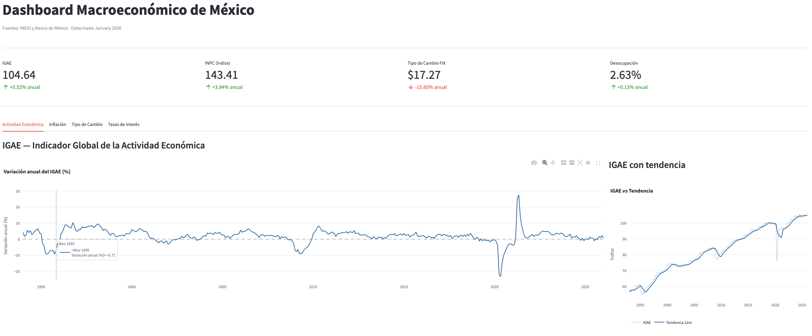
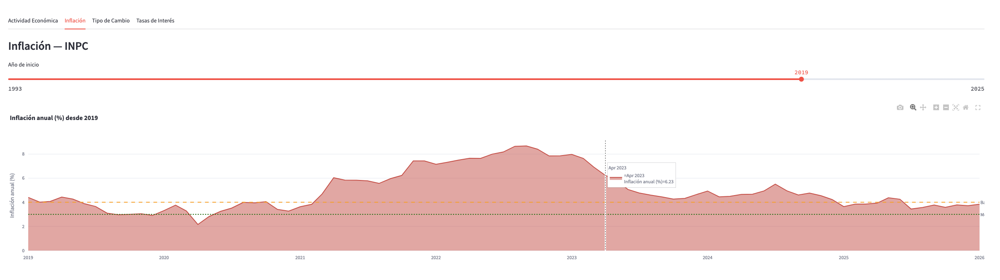
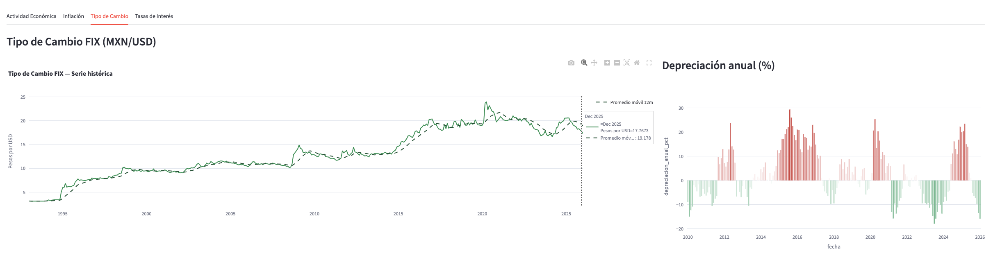
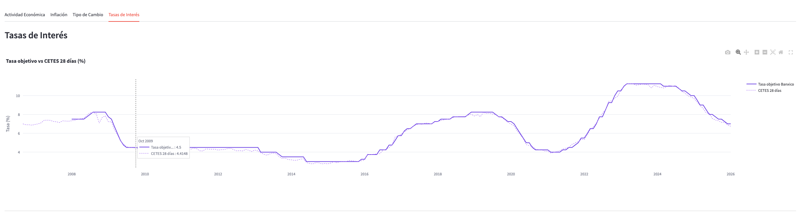
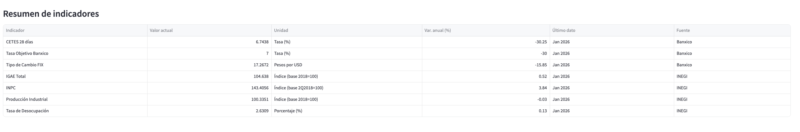

# Dashboard Macroeconómico de México

Panel interactivo para visualizar indicadores macroeconómicos de México. Integra datos de **INEGI** y **Banco de México** en una base **PostgreSQL** y los presenta en un dashboard construido con **Streamlit** y **Plotly**.

## Vista previa

| KPIs y actividad económica | Inflación |
|:---:|:---:|
|  |  |

| Tipo de cambio | Tasas de interés |
|:---:|:---:|
|  |  |



## Indicadores

| Serie | Fuente |
|-------|--------|
| IGAE Total | INEGI |
| Producción Industrial | INEGI |
| INPC | INEGI |
| Tasa de Desocupación | INEGI |
| Tipo de Cambio FIX | Banxico |
| CETES 28 días | Banxico |
| Tasa Objetivo | Banxico |

## Stack

- **Python** · pandas · SQLAlchemy · psycopg2
- **PostgreSQL** — almacenamiento y vistas analíticas
- **Streamlit** · **Plotly** — dashboard interactivo

## Estructura del proyecto

```
dashboard-macro-mexico/
├── app/
│   └── dashboard.py          # Dashboard Streamlit
├── data/
│   └── raw/                  # Panel desestacionalizado (CSV)
├── img/                      # Capturas del dashboard
├── scripts/
│   ├── 01_preparar_csv.py    # Transformación a formato largo
│   └── 02_cargar_postgres.py # Carga a PostgreSQL
├── sql/
│   ├── 01_crear_tablas.sql
│   ├── 02_cargar_datos.sql
│   ├── 03_queries_analiticas.sql
│   └── 04_crear_vistas.sql
├── base_datos_design.md
├── requirements.txt
└── env.env.example
```

## Instalación

### 1. Clonar y preparar entorno

```bash
git clone https://github.com/estefany-moreno/dashboard-macro-mexico.git
cd dashboard-macro-mexico
python -m venv venv
source venv/bin/activate        # Windows: venv\Scripts\activate
pip install -r requirements.txt
```

### 2. Configurar base de datos

Crea la base de datos en PostgreSQL y copia las credenciales:

```bash
cp env.env.example env.env
# Edita env.env con tus datos de conexión
```

### 3. Ejecutar pipeline

```bash
# Crear tablas
psql -d macro_mexico -f sql/01_crear_tablas.sql

# Preparar datos y cargar a PostgreSQL
python scripts/01_preparar_csv.py
python scripts/02_cargar_postgres.py

# Crear vistas analíticas
psql -d macro_mexico -f sql/04_crear_vistas.sql
```

### 4. Lanzar el dashboard

```bash
streamlit run app/dashboard.py
```

## Base de datos

Modelo relacional en formato largo: catálogo de indicadores (`indicadores`) y series de tiempo mensuales (`observaciones`). Las vistas `vw_inflacion`, `vw_igae`, `vw_tipo_cambio`, `vw_tasas` y `vw_indicadores_actuales` alimentan el dashboard.

Ver esquema en [`base_datos_design.md`](base_datos_design.md).

## Notas

- Los scripts de carga son **re-ejecutables** sin duplicar datos.
- Las series con transformación logarítmica (`aplica_log`) se manejan correctamente en las vistas y consultas analíticas.
- El archivo `env.env` no se incluye en el repositorio; usa `env.env.example` como plantilla.
